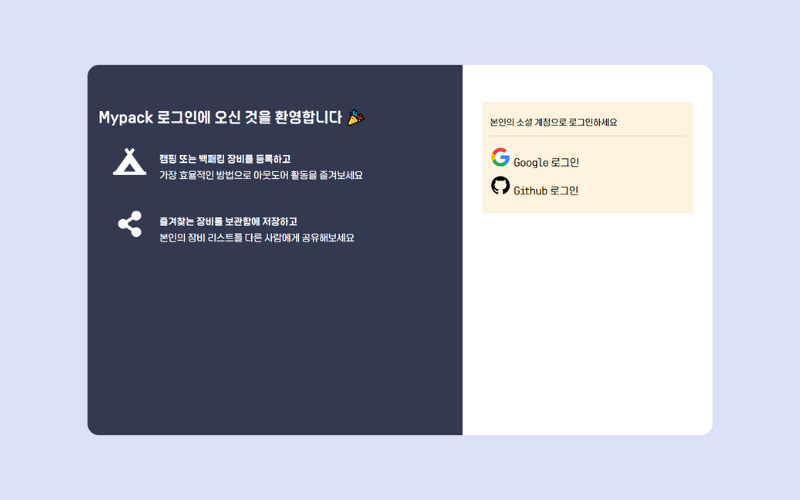
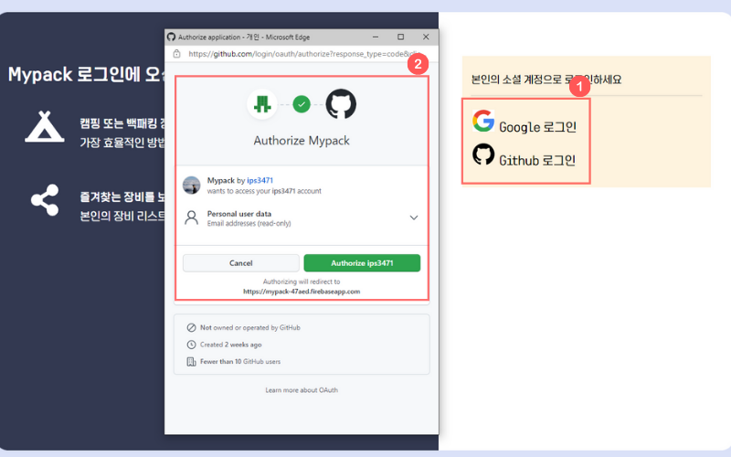
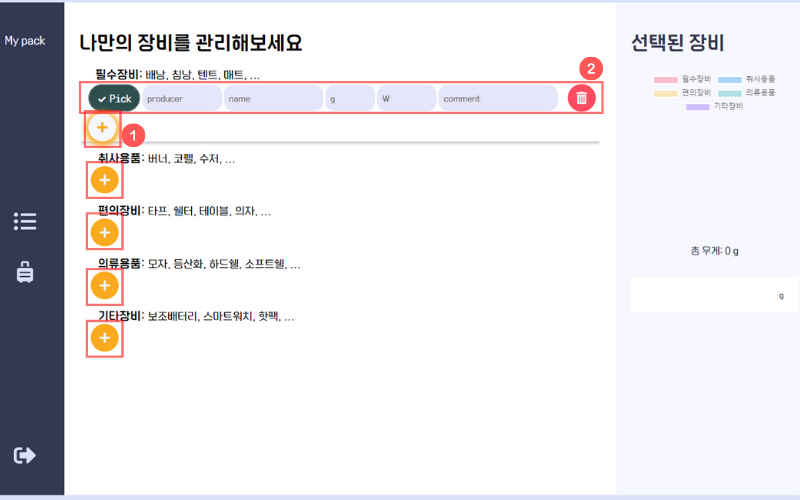
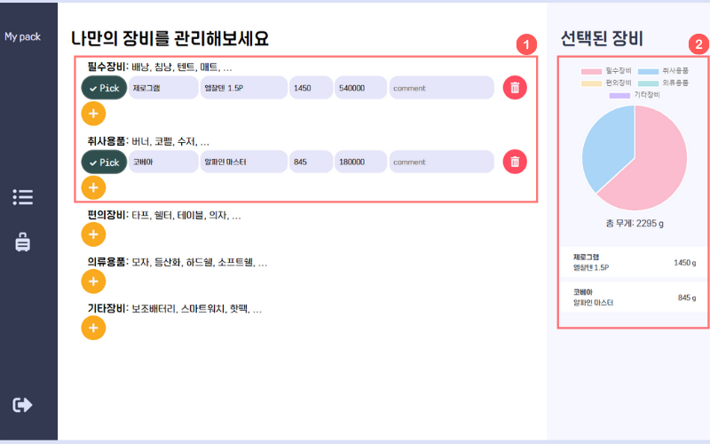

# Mypack - 나만의 백패킹 장비관리

캠핑 혹은 백패킹을 하는 사람들이 자신의 장비를 데이터로 저장하고 자주 쓰는 장비와 그렇지 않은 장비를 효율적으로 관리할 수 있도록 돕는 웹 어플리케이션

## 주요기능

- 장비를 목록에 등록
- 등록된 장비를 목록에서 제거
- 자주쓰는 장비를 선택하여 관리
- 선택된 장비의 총 무게를 자동으로 계산
- 선택된 장비의 무게분포를 도표로 제공

## 사용방법

1. Mypack에 접속 (https://612f197dd65251751fd9564b--mypack.netlify.app/)
   
2. 소셜계정을 이용하여 로그인
   
3. 더하기 버튼을 클릭하면 새로운 폼이 생성됩니다.
   
4. 장비 정보를 무게와 함께 입력하면 **Pick**이 활성화된 장비들의 총 무게와 관련정보가 도표로 보여집니다.
   

## 준비중인 기능

- 나의 장비목록을 다른사람에게 공유

## 버그제보 및 서비스 추가 건의

- ips3471@gmail.com
